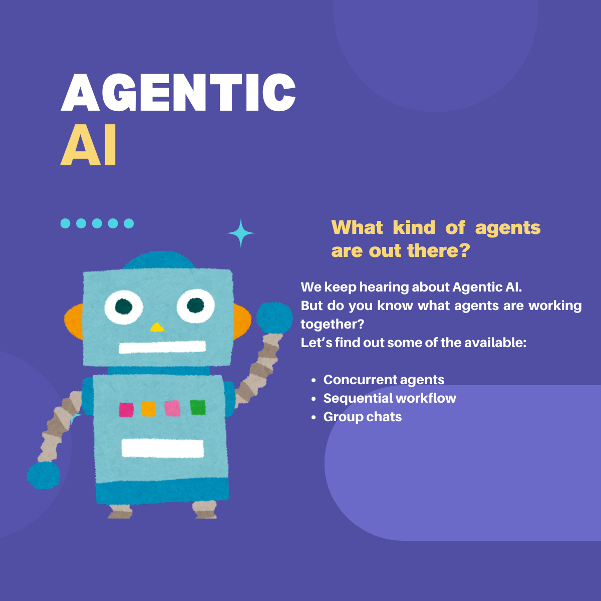
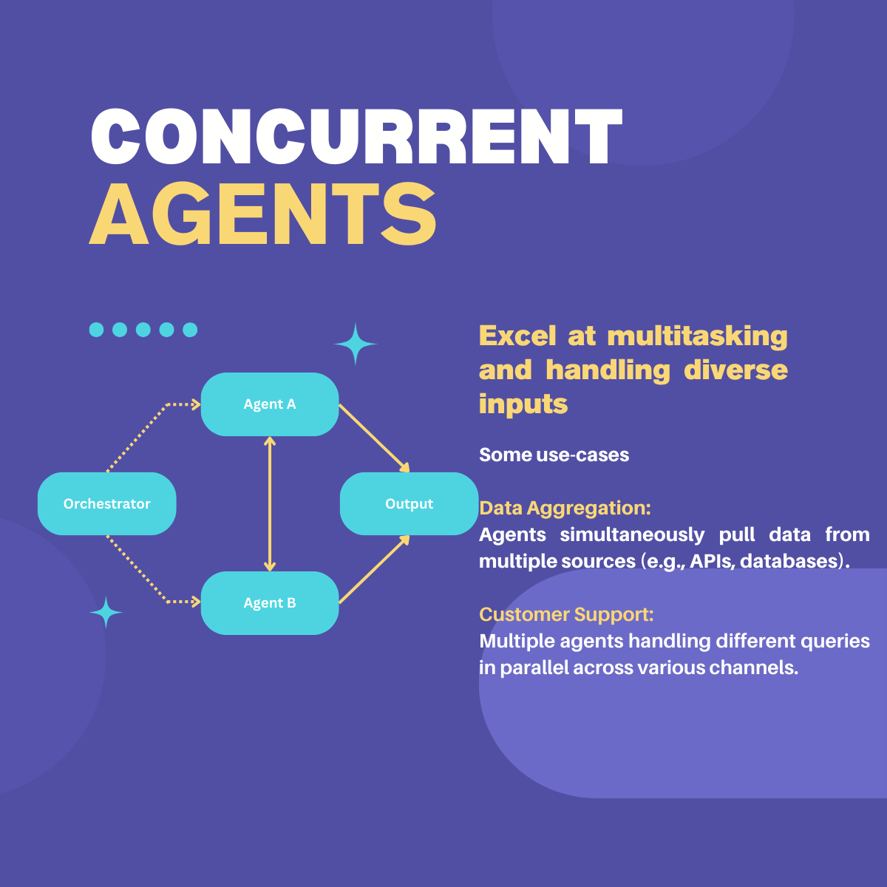
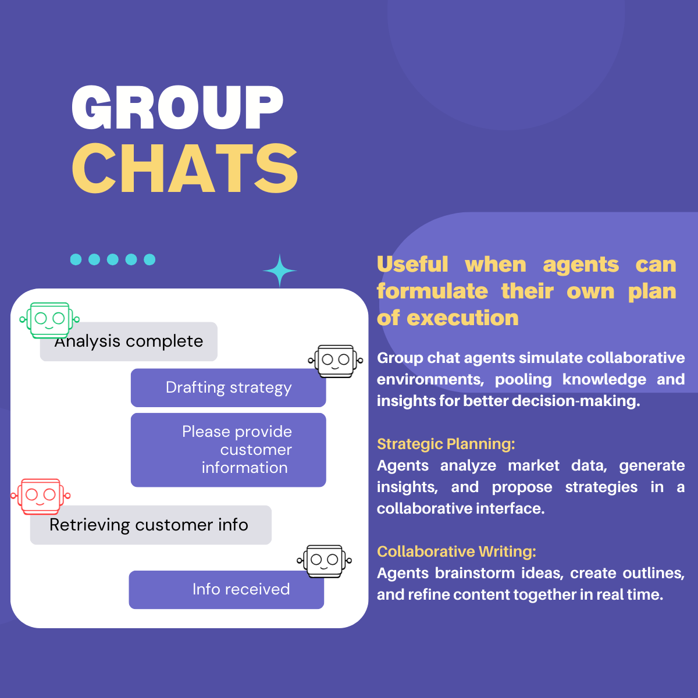
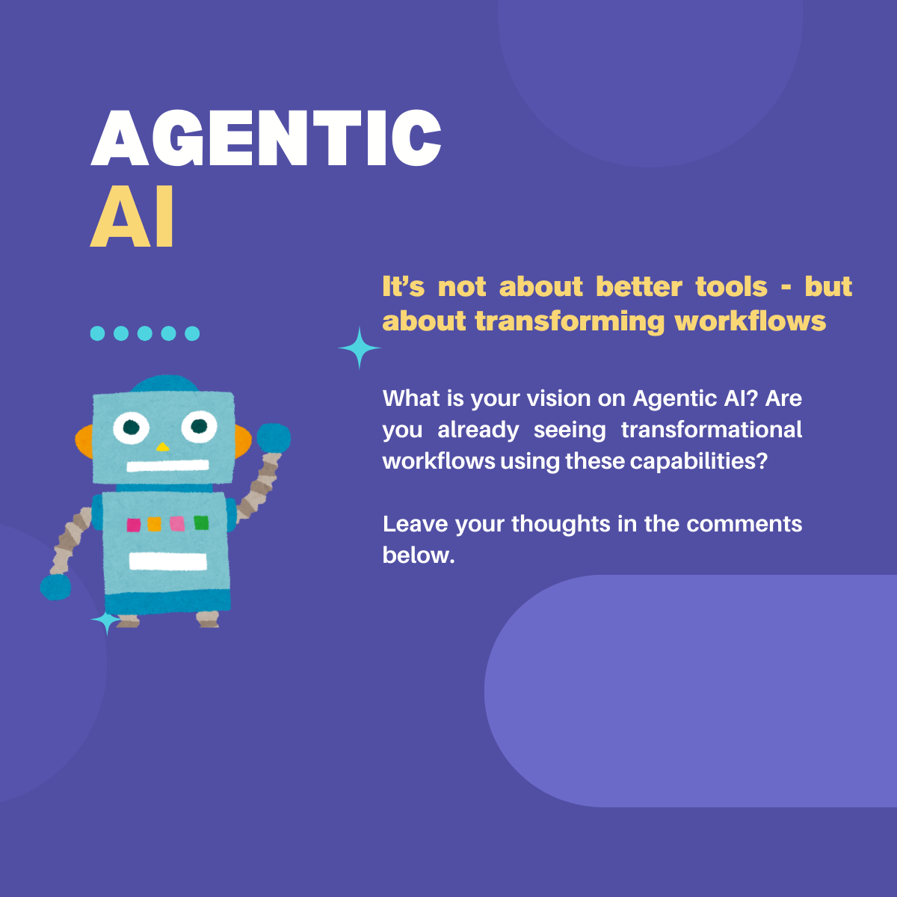

# Understanding Agentic AI Types

Yesterday, we touched on the concept of agentic AI. Today, let's dive deeper into how different types of agents work and collaborate to optimize workflows and drive business success.

From automating workflows to facilitating team communication, these agents can drive innovation and streamline your processes.

Swipe through to learn how these agents can revolutionize your business:

1️⃣ **Concurrent Agents**: Multitask and tackle multiple processes simultaneously.

2️⃣ **Sequential Workflows**: Streamline complex operations step-by-step with precision.

3️⃣ **Group Chat AI**: Enhance collaboration and decision-making through dynamic discussions.

